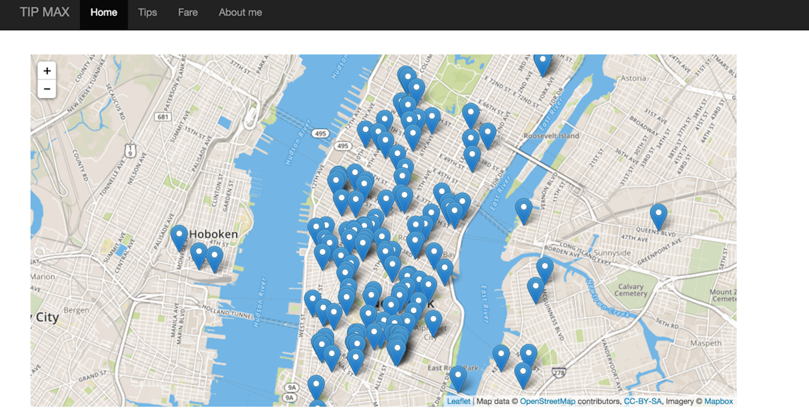
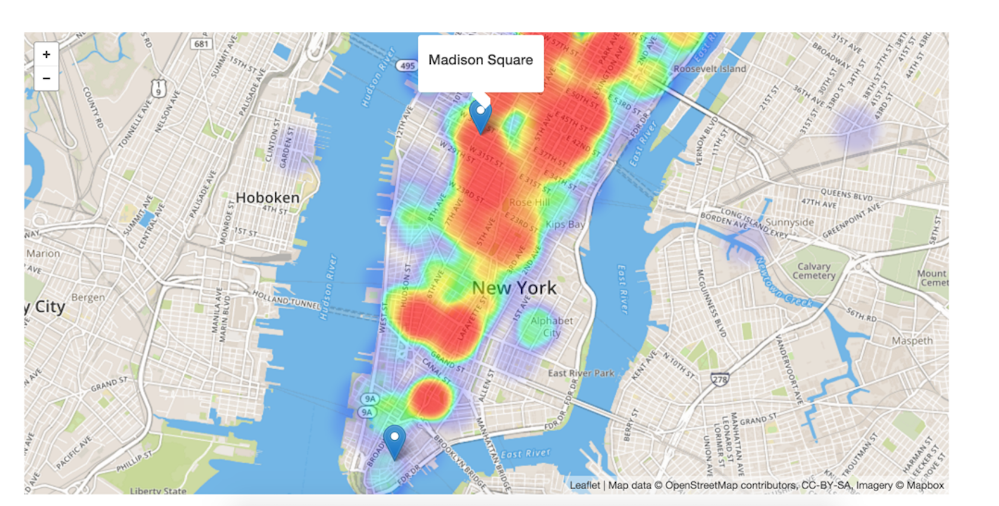
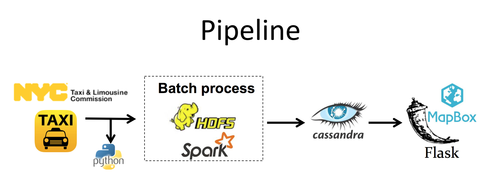

# TIPMAX

## Motivation

My Insight project is to design a web app, named Tip Max, to help (NYC) taxi drivers to maximize their incomes. It can visualize the pick-up locations, like  the tip percentage, defined by tips/fare 
and the total fare that passanges paid profiles over the New York city in the past years. The latter two features are visualized using heatmap, like The Tip Max is able to help taxi drivers to know the best location to increase their income. The web is at http://tipmaxnyc.xyz.

##Technical Details

### Pipeline

The project pipeline icnludes two parts. I fetched the taxi data from New York city government, which offered 2009-2015 Jun data. The total amount is about 200GB and there are 13 billions events in the data. Also, the data is not ordered in time. So after locaing the data into the distributed file system HDFS, first we perform the batch processes to group the data by date. The pipeline is as follows 
I chose to use Spark to do batch process to store the taxi data in the Cassandra database, ordered by time. When one wish to visualize the pick-up locations, tips or fare profiles for a certain date and time, the Flask will query from Cassandra and shows the profile in MapBox.

### Real-time streaming process 
