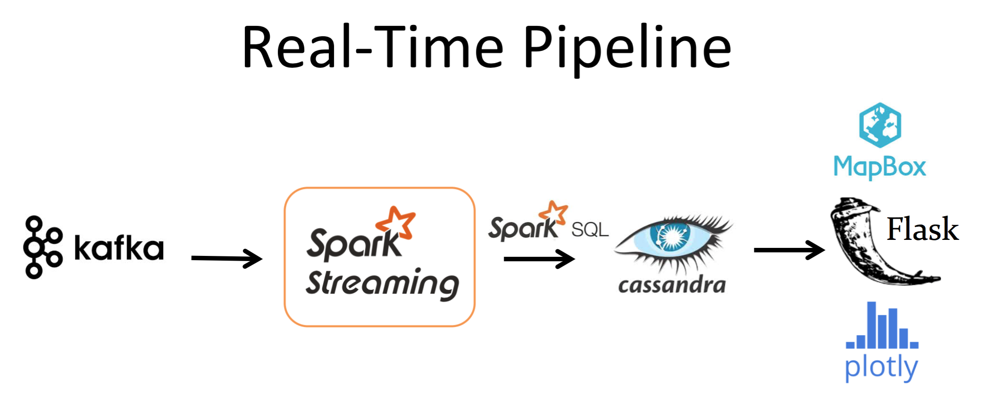
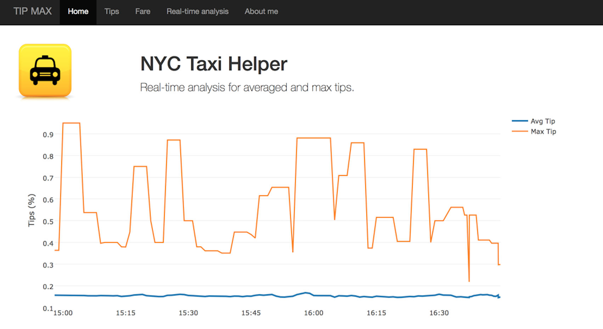

# TIP MAX

## Motivation

My Insight project is to design a web app, named Tip Max, to help (NYC) taxi drivers to maximize their incomes. It can visualize the pick-up locations, like  and the profiles of the tip percentage (defined by tips/fare) 
and the total fare that passengers paid over the New York city in the past years. The latter two features are visualized using heatmap, like  By the above geolocation examples, taxi drivers can know that passengers around middle town are more generous than those from other regions. At a given time, the Tip Max is able to help taxi drivers to know the best location to increase their income from the hsitorial data and even forecast. The web is available at http://www.hsianghung.tech/app/ and the demo vedio is at http://www.youtube.com/watch?v=9FxNrReqnvE.

##Technical Details

The whole project pipeline icnludes two parts: static pipeline and real-time streaming.

### Static pipeline

For the first part, I fetched the taxi data from the New York city government website, which offered 2009 Jan.- 2015 June data. The total amount is about 200GB and there are 13 billions events in the datasets. Also, the data is not ordered in time. So after loading the clean data (using Pythong to clean data) into the file distributed system HDFS, first we perform the batch processes to group the data by date. The pipeline is as follows 
I chose to use Apache Spark to do the MapReduce to filter out "payement type" and rearraned the event timestamp, and stored the time-ordered outcome in the NoSQL database, Cassandra. Compared to Hadoop MapReduce, Spark is very efficient to store data as RDD format in memory. On the other hand, Cassandra plays a good role to provide high availability in writing. When one wishes to visualize the pick-up locations, tips or fare profiles for a certain date and time, the Flask will query data from Cassandra and shows the profile in MapBox (like previous two figures).

### Real-time streaming process 

The second part is the real-time streaming process. The NYC does not provide live-streaming taxi data. Based on this reason, I engineered the real-time streaming data by repeatedly reading a file (which comes from a historial daily data file) and transporting the messages. In this case we can mock real-time data source and implement Kafka to ingest data. The Python code, "tick_kafkaproducer.py", is designed for this function, and, meanwhile, it plays a role as a Kafka producer. On the other hand, the Spark Streaming is running simultaneously, and plays as a Kafka consumer role to fetch the data. 

After collecting data, the Spark streaming filters out the events based on the current (eastern) time, and then we implement the Spark-SQL to do aggregation operations, such as listing top-five high-tip locations and finding averaged/maximum tips during the time window. The time window could be few seconds or a minute, set in Spark Streaming. The aggregated outputs are stored into the Cassandra DB. For the real-time streaming process, with a proper schema, Cassandra is a natural database tool to store time-ordered data.

The above figure shows two mocked real-time processes. The left and right panels are given by using MapReduce to filter out "payment type == credit card" and "== cash", respectively. The averaged tips and max tips are the aggregated outputs, from the data ingestion using Kafka and batch process using Spark Streaming to filter out "current time" over the New York city. For reality, the plot needs a minute for a period to update since the data ingestion needs a minute for a cycle (to read from an entire file). However, the data aggregated time can be arbitrarily tuned as there really exists real-time input. To demonestrate, the figure shown above, simulates the dynamic profile updated within every 2 seconds. With these processes, one can further consider more complicated queries, such as comparing the tips when picking up passengers from distinct locations, or adding constraint on drop time, etc.

### Work platform
The entire work is preformed on the AWS using four m4.large instances.
